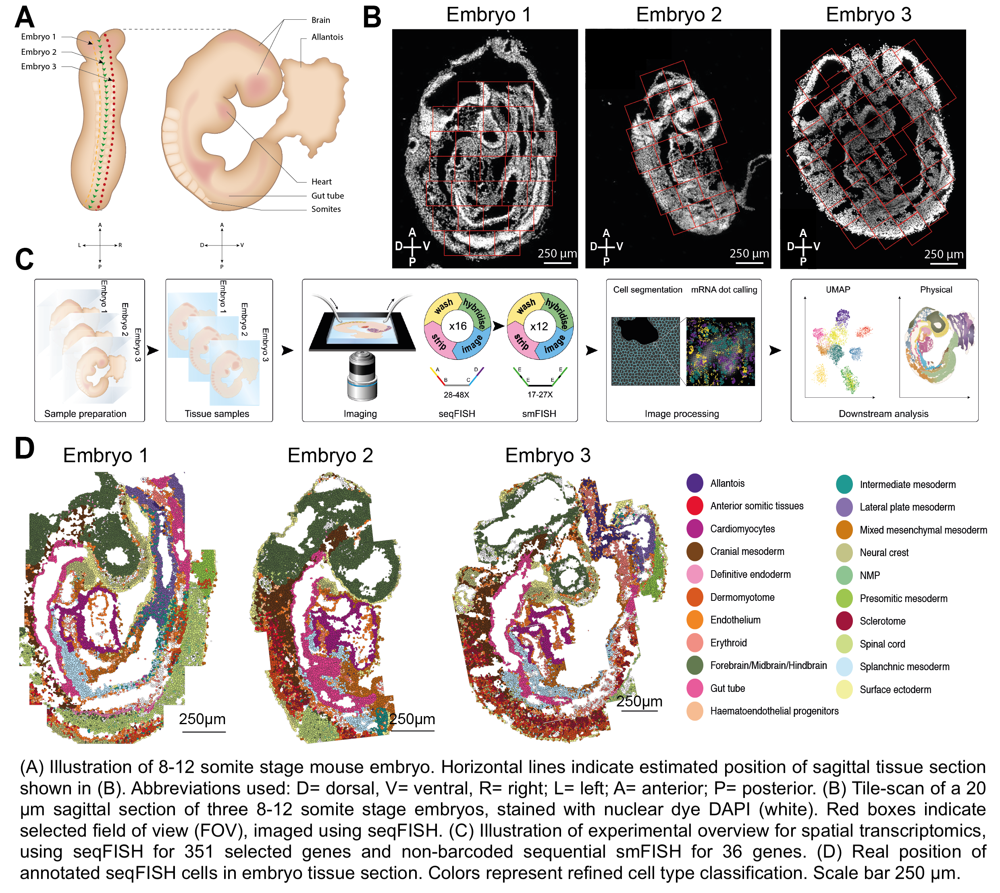

# SpatialMouseAtlas2020

Data processing and analysis scripts for our spatial profiling of mouse embryos using seqFISH as described in https://www.biorxiv.org/content/10.1101/2020.11.20.391896v1

  
 

`scripts`: Scripts can be found in the `scripts` folder, with a description and order of running in `script_descriptions.txt`

`functions`: R code containing functions required for running scripts.

`SpatialMouseAtlas`: Code for the Shiny app can be found in the `SpatialMouseAtlas` folder. Note that the `data` folder within the app can be downloaded from the Data link (below).

#### Further information

Processed Data Download: is available to download here https://content.cruk.cam.ac.uk/jmlab/SpatialMouseAtlas2020/

Shiny app: Interactive visualisation here https://marionilab.cruk.cam.ac.uk/SpatialMouseAtlas/

Gene expression imputation, midbrain-hindbrain boundary selection, and independent smFISH processing: Scripts are available here https://github.com/MarioniLab/amScripts_mouseEmbryoFISH

Contact: shila.ghazanfar - at - cruk.cam.ac.uk or marioni - at - ebi.ac.uk